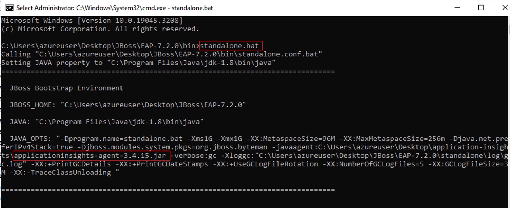
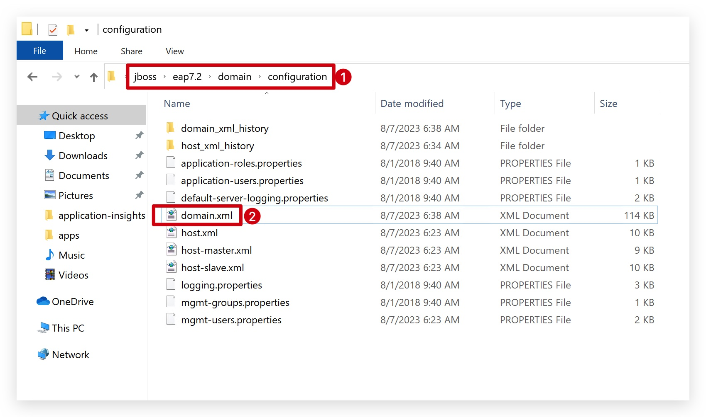
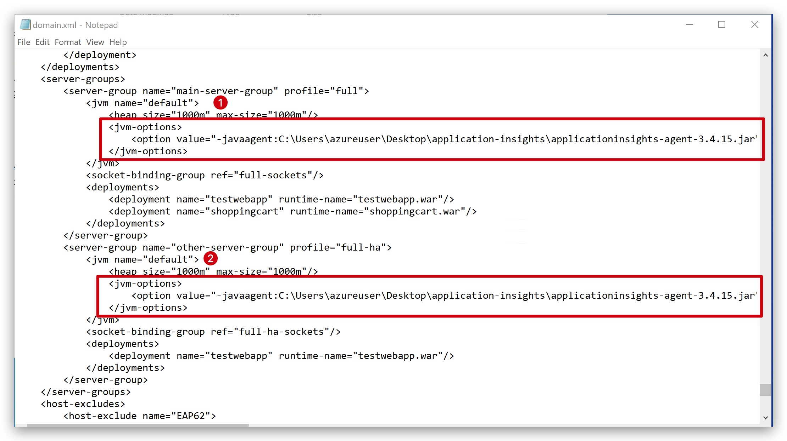
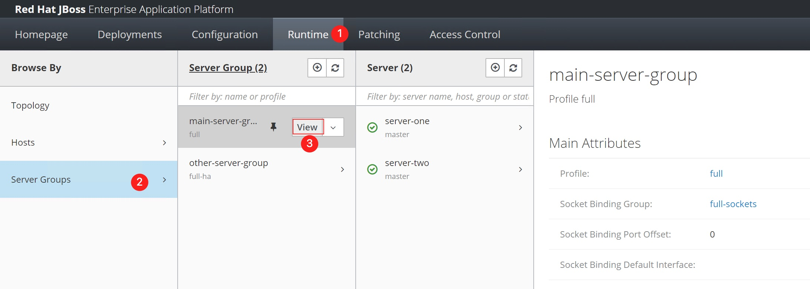
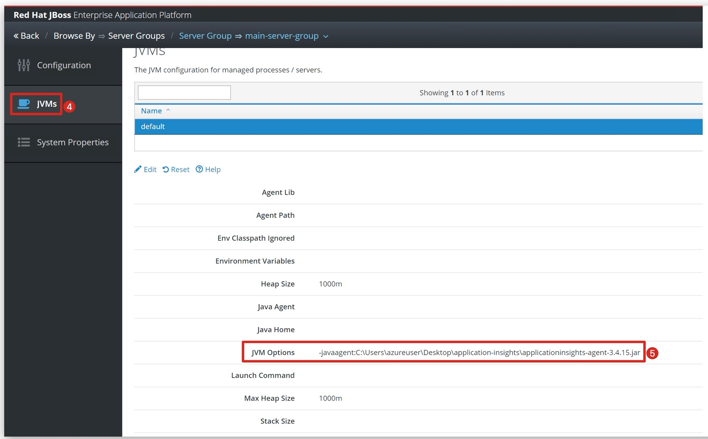
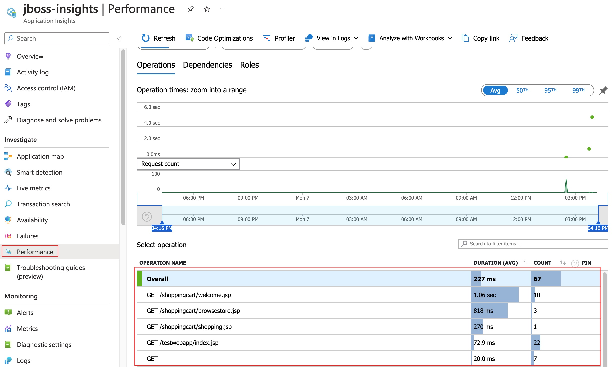

- [Azure Application Insights with JBoss On Windows](#azure-application-insights-with-jboss-on-windows)
   * [Azure Application Insights with JBoss Standalone mode](#azure-application-insights-with-jboss-standalone-mode)
   * [Azure Application Insights with JBoss Domain mode](#azure-application-insights-with-jboss-domain-mode)
- [Azure Application Insights with JBoss On Linux](#azure-application-insights-with-jboss-on-linux)


# Azure Application Insights with JBoss On Windows

## Azure Application Insights with JBoss Standalone mode

1. Follow this guide: [JBOSS EAP 7.2 Installation On Window 10 With JDK 1.8](https://www.youtube.com/watch?v=FCgTSgGaxD8) to install JBoss on windows

2. Follow this guide [Create an Application Insights Resource](https://learn.microsoft.com/en-us/azure/azure-monitor/app/create-workspace-resource#create-a-workspace-based-resource) to create Application Insights.

3. Get the Connection String from your Application Insights Resource

   1. To copy your unique Connection String:

      [](https://learn.microsoft.com/en-us/azure/azure-monitor/app/media/migrate-from-instrumentation-keys-to-connection-strings/migrate-from-instrumentation-keys-to-connection-strings.png#lightbox)

      1. Go to the **Overview** pane of your Application Insights resource.
      2. Find your **Connection String**.
      3. Hover over the connection string and select the **Copy to clipboard** icon.

4. Prepare  Application Insights library and configuration.

   1. Create an folder called `application-insights` on the Desktop.

   2. Download the [applicationinsights-agent-3.4.15.jar](https://github.com/microsoft/ApplicationInsights-Java/releases/download/3.4.15/applicationinsights-agent-3.4.15.jar) file to the folder.

   3. Create a configuration file named `applicationinsights.json`, and place it in the same directory as `applicationinsights-agent-3.4.15.jar` with the following content:

      - Replace with the Connection String you just copied.

      ```
      {
        "connectionString": "<Your Connection String>"
      }
      ```

5. **Modifiy** JBoss startup scripts.  

   1. Get into the `bin` directory where the JBoss installed.  

      

   2. Add below configuration to the end of the `standalone.conf.bat`file.  
   
      ```
      set "JAVA_OPTS=%JAVA_OPTS% -javaagent:<Your Path>\application-insights\applicationinsights-agent-3.4.15.jar"
      ```

      

6. Start JBoss
   1. Run cmd console in the `bin` direcotry, and run `standalone.bat`
   
      You should see the **JAVA_OPTS** contains `applicationinsights-agent-3.4.15.jar`.
   
      
   
7. Check metrics in Application Insights Portal
   1. You should be able to status like below in the Application Insights Portal.
      1. 

## Azure Application Insights with JBoss Domain mode

1. Follow this guide: [JBOSS EAP 7.2 Installation On Window 10 With JDK 1.8](https://www.youtube.com/watch?v=FCgTSgGaxD8) to install JBoss on windows

2. Follow this guide [Create an Application Insights Resource](https://learn.microsoft.com/en-us/azure/azure-monitor/app/create-workspace-resource#create-a-workspace-based-resource) to create Application Insights.

3. Get the Connection String from your Application Insights Resource

   1. To copy your unique Connection String:

      [](https://learn.microsoft.com/en-us/azure/azure-monitor/app/media/migrate-from-instrumentation-keys-to-connection-strings/migrate-from-instrumentation-keys-to-connection-strings.png#lightbox)

      1. Go to the **Overview** pane of your Application Insights resource.
      2. Find your **Connection String**.
      3. Hover over the connection string and select the **Copy to clipboard** icon.

4. Prepare  Application Insights library and configuration.

   1. Create an folder called `application-insights` on the Desktop.

   2. Download the [applicationinsights-agent-3.4.15.jar](https://github.com/microsoft/ApplicationInsights-Java/releases/download/3.4.15/applicationinsights-agent-3.4.15.jar) file to the folder.

   3. Create a configuration file named `applicationinsights.json`, and place it in the same directory as `applicationinsights-agent-3.4.15.jar` with the following content:

      - Replace with the Connection String you just copied.

      ```
      {
        "connectionString": "<Your Connection String>"
      }
      ```
   
   4. Your folder should like this:  
      - 

5. **Modifiy** JBoss startup scripts.

   1. Get into the domain `configuration` directory where the JBoss installed.

      

   2. Update the `domain.xml`file with JVM options 

      ```
      ...
      <jvm-options>
          <option value="-javaagent:-javaagent:<Your Path>\application-insights\applicationinsights-agent-3.4.15.jar"/>
      </jvm-options>
      ...
      ```

      

6. Start JBoss
   1. Run cmd console in the `bin` direcotry, and run `domain.bat`  
      After all the servers are up, you should be able to see the **JAVA_OPTS** contains `applicationinsights-agent-3.4.15.jar` through management portal.

      
      

7. Check metrics in Application Insights Portal
   1. You should be able to status like below in the Application Insights Portal.
      1. 

# Azure Application Insights with JBoss On Linux


