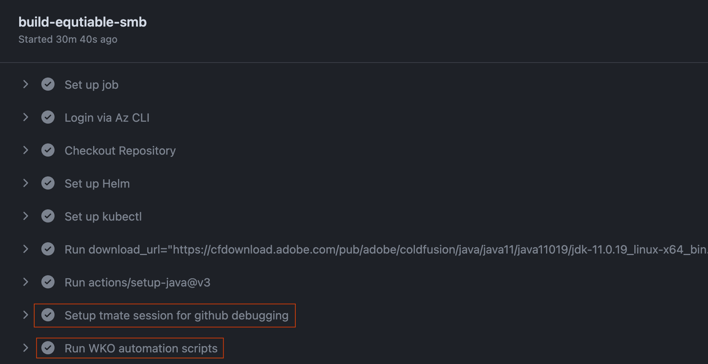
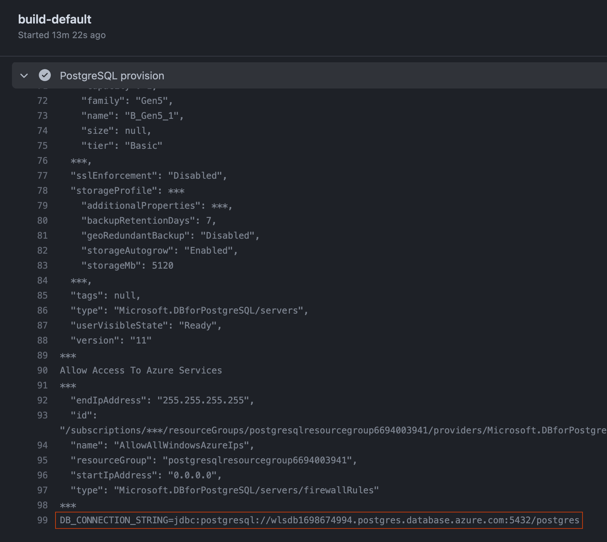
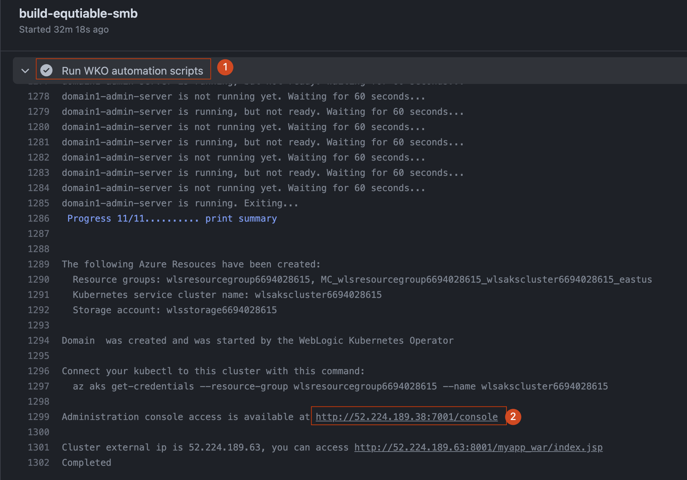
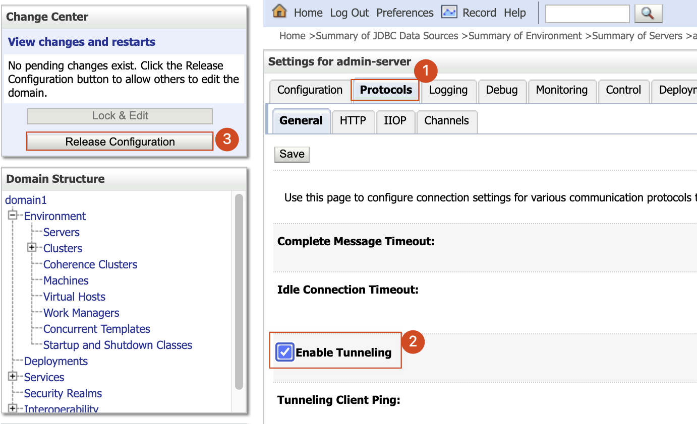
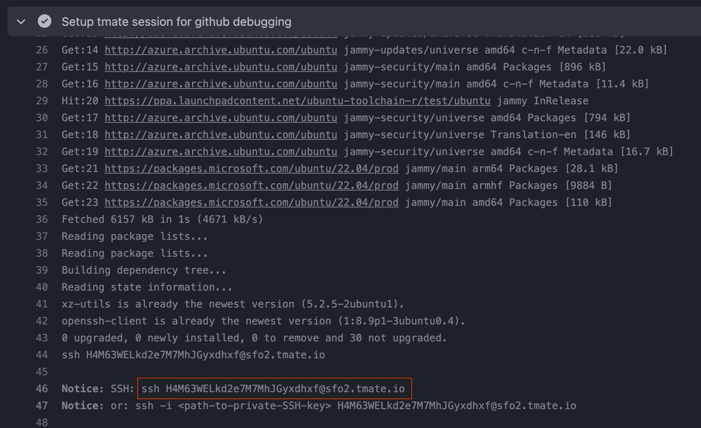
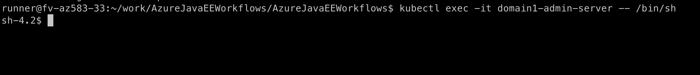
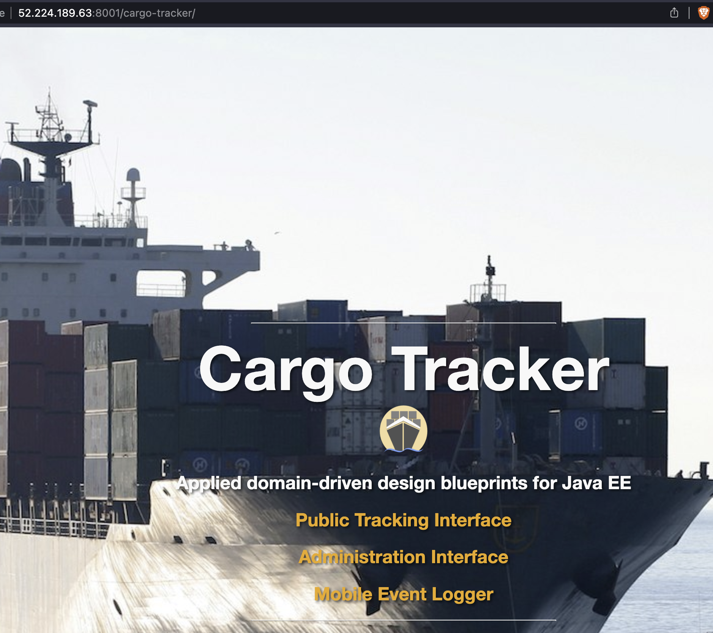

# Stress test Domain on pv with smb

# How I did the tests.

## Prepare Test Environment

1. Use the workflow to prepare a postgresql server.
2. Use the workflow to prepare a weblogic server.

   You should be able to see logs like below:

   


## DB Setup and Environment

1. DB Setup
    1. Copy the DB_CONNECTION_STRING from the postgresql workflow’s log

       

    2. Login the weblogic web console.
        - Click the `Run WKO automation scripts` and check the end of the log.

       

        - Open the link that ends with `7001/console`
        - Follow below link to configure `CargoTrackerDB` datasource.

       [Tutorial: Manually install Oracle WebLogic Server on Azure Virtual Machines - Java on Azure](https://learn.microsoft.com/en-us/azure/developer/java/migration/migrate-weblogic-to-azure-vm-manually?tabs=oracle-linux#configure-the-database-connection-for-the-wls-cluster)


2. [Clone and build Cargo Tracker](https://github.com/Azure-Samples/cargotracker-wls-aks#clone-and-build-cargo-tracker)

   Clone the sample app repository to your development environment.

    ```
    mkdir cargotracker-wls-aks
    DIR="$PWD/cargotracker-wls-aks"
    
    git clone https://github.com/Azure-Samples/cargotracker-wls-aks.git ${DIR}/cargotracker
    ```

   Change directory and build the project.

    ```
    mvn clean install -PweblogicOnAks --file ${DIR}/cargotracker/pom.xml
    ```

   After the Maven command completes, the WAR file locates in `${DIR}/cargotracker/target/cargo-tracker.war`.


### Deploy with Web Console

### Deploy with commandline

- **Enable Tunneling of adminserver**
    - Login weblogic web console.
    - Click Domain—>Environment—>Servers—>admin Server —> Protocols
    - Check **Enable Tunneling.**

      

- SSH to domain server
    - Copy the ssh command in `Setup tmate session for github debugging` and run in local terminal.

      

    - Run `kubectl exec -it domain1-admin-server -- /bin/sh` to get into the admin server.

      

    - Run below command to deploy/undeploy cargo-tracker several times and check the result

        ```shell
        cd /u01/oracle/wlserver/server/lib
        # deploy
        java -cp weblogic.jar weblogic.Deployer -adminurl http://${adminIp}:7001 -username weblogic -password ${wlpassword} -deploy ${file_path} -name cargo-tracker -targets cluster-1
        
        # undeploy
        java -cp weblogic.jar weblogic.Deployer -adminurl http://${adminIp}:7001 -username weblogic -password ${wlpassword} -undeploy  -name cargo-tracker
        
        ```

      


### Test Results

JDK17 + Equtiable-smb + Weblogic

1. Deploy with Web Console
    1. ✅ Manually Deploy and Undeploy cargo-tracker a few times and check the accessibility.
2. Deploy with commandline.
    1. ✅ Manually Deploy and Undeploy cargo-tracker a few times and check the accessibility.

JDK11 + Equtiable-smb + Weblogic

1. Deploy with Web Console
    1. ✅ Manually Deploy and Undeploy cargo-tracker a few times and check the accessibility.
2. Deploy with commandline.
    1. ✅ Manually Deploy and Undeploy cargo-tracker a few times and check the accessibility.
