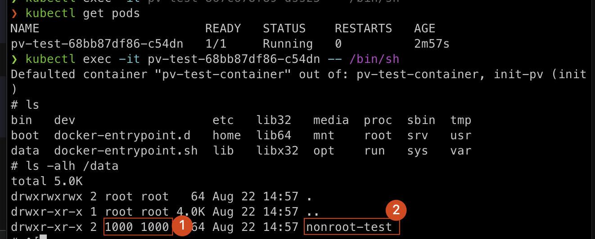

- [Verify Initcontainer Running as Non-root Has Write Permisson on PV in Aks](#verify-initcontainer-running-as-non-root-has-write-permisson-on-pv-in-aks)
  * [Prerequisites](#prerequisites)
  * [Step1. create aks](#step1-create-aks)
  * [Step2. Create storage class](#step2-create-storage-class)
  * [Step3. Create PVC](#step3-create-pvc)
  * [Step4. Deploy pv-test](#step4-deploy-pv-test)
  * [Step4. Verify](#step4-verify)
  * [Delete Resources](#delete-resources)

# Verify Initcontainer Running as Non-root Has Write Permisson on PV in Aks with NFS

## Prerequisites

Check the [prerequisites](https://oracle.github.io/weblogic-kubernetes-operator/samples/azure-kubernetes-service/domain-on-pv/#prerequisites "prerequisites")

## Step1. Create aks

- Create AKS 
    ```bash
    # Change these parameters as needed for your own environment
    # Specify a prefix to name resources, only allow lowercase letters and numbers, between 1 and 7 characters
    export NAME_PREFIX=nfs
    # Used to generate resource names.
    export TIMESTAMP=`date +%s`
    export AKS_CLUSTER_NAME="${NAME_PREFIX}aks${TIMESTAMP}"
    export AKS_PERS_RESOURCE_GROUP="${NAME_PREFIX}resourcegroup${TIMESTAMP}"
    export AKS_PERS_LOCATION=eastus
    
    az group create --name $AKS_PERS_RESOURCE_GROUP --location $AKS_PERS_LOCATION
    az aks create \
       --resource-group $AKS_PERS_RESOURCE_GROUP \
       --name $AKS_CLUSTER_NAME \
       --node-count 2 \
       --generate-ssh-keys \
       --nodepool-name nodepool1 \
       --node-vm-size Standard_DS2_v2 \
       --location $AKS_PERS_LOCATION \
       --enable-managed-identity
    
    ```

- Connect to aks cluster
    ```bash
    az aks get-credentials --resource-group $AKS_PERS_RESOURCE_GROUP --name $AKS_CLUSTER_NAME
    ```

## Step2. Create storage class

```bash
cat > azurefile-csi-nfs.yaml <<EOF
apiVersion: storage.k8s.io/v1
kind: StorageClass
metadata:
  name: azurefile-csi-nfs
provisioner: file.csi.azure.com
allowVolumeExpansion: true
parameters:
  protocol: nfs
mountOptions:
  - nconnect=4
EOF


kubectl apply -f azurefile-csi-nfs.yaml
```


## Step3. Create PVC

```bash
cat > pvc.yaml <<EOF
apiVersion: v1
kind: PersistentVolumeClaim
metadata:
  name: wls-azurefile-${TIMESTAMP}
spec:
  accessModes:
    - ReadWriteMany
  storageClassName: azurefile-csi-nfs
  resources:
    requests:
      storage: 100Gi
EOF

kubectl apply -f pvc.yaml

```

## Step4. Deploy pv-test

```bash
cat > pv-test.yaml << EOF

apiVersion: apps/v1
kind: Deployment
metadata:
  name: pv-test
spec:
  replicas: 1
  selector:
    matchLabels:
      app: pv-test
  template:
    metadata:
      labels:
        app: pv-test
    spec:
      containers:
      - name: pv-test-container
        image: nginx
        volumeMounts:
        - name: test-volume
          mountPath: /data
      volumes:
      - name: test-volume
        persistentVolumeClaim:
          claimName: wls-azurefile-${TIMESTAMP}
      initContainers:
      - name: init-pv
        image: busybox
        command:
        - /bin/sh
        - -c
        - |
          adduser --disabled-password nonroot && 
          su - nonroot -c "mkdir -p /data/nonroot-test"
        volumeMounts:
        - mountPath: /data
          name: test-volume
EOF

kubectl apply -f pv-test.yaml


```


## Step4. Verify

1.  Running `kubectl get pods`, you should see output like below, copy the name: pv-test-68bb87df86-c54dn
    ```bash
    > kubectl get pods
    NAME                       READY   STATUS    RESTARTS   AGE
    pv-test-68bb87df86-c54dn   1/1     Running   0          2m57s
    ```
2.  Update and run below command
    ```bash
    
        kubectl exec -it $(kubectl get pods -o=jsonpath='{.items[0].metadata.name}') -- /bin/sh

    ```
3.  Run command `ls -alh /data`
    ```bash
    ls -alh /data
    ```
    -   **Mark-1**: the folder is created by non-root  
    


## Delete Resources

```bash
rm pv.yaml, pvc.yaml, pv-test.yaml
az group delete --name $AKS_PERS_RESOURCE_GROUP

```
