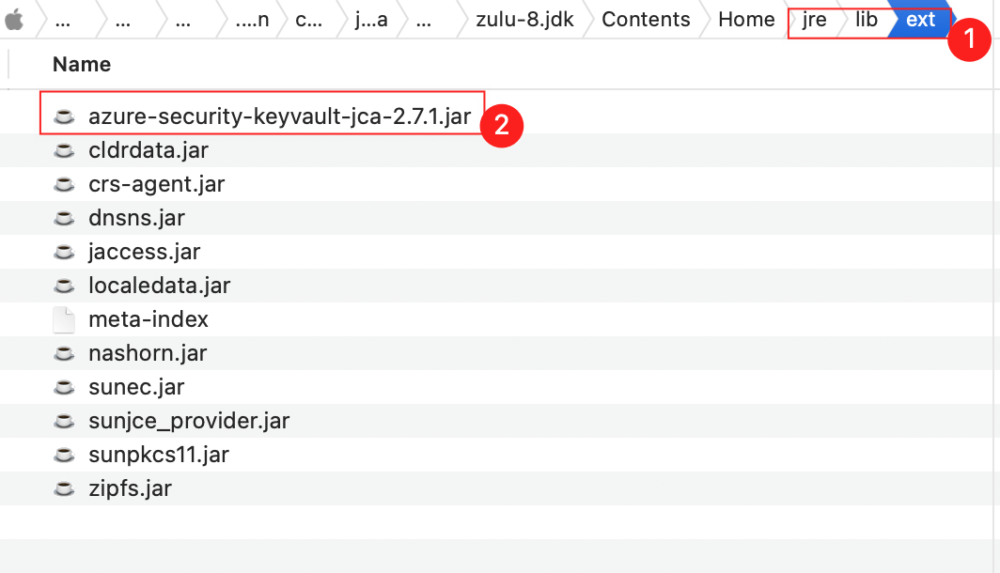
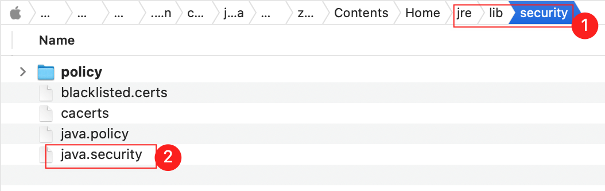
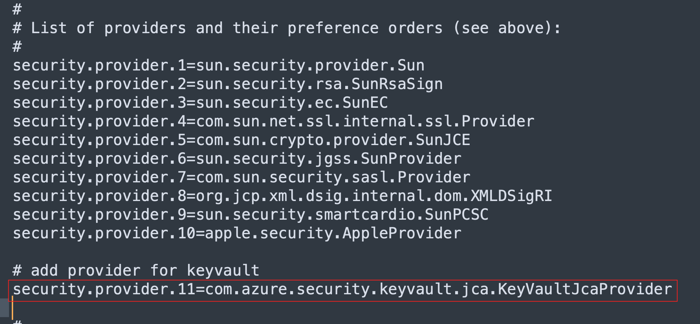
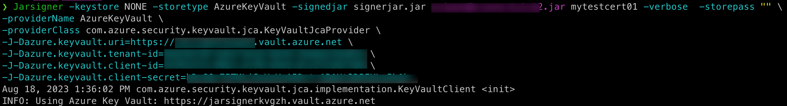
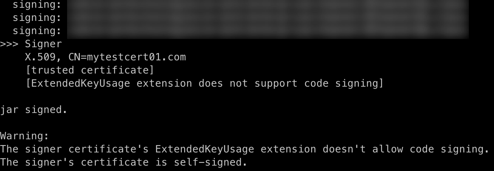

# Integrate KeyVault JCA provider with Jarsigner


## Pre-requisites
1. Prepare a certificate in Azure KeyVault.
1. Prepare a service principal
1. Assign the principal with read and write permissoins of the KeyVault.

## Steps

1. Config JCA provider jar
    1. Download azure-security-keyvault-jca from maven [repository](https://mvnrepository.com/artifact/com.azure/azure-security-keyvault-jca)
    1. Place the jar under the folder `${JAVA_HOME/jre/lib/ext}`
        - 
    1. Open the file `java.security` in `${JAVA_HOME/jre/lib/security}`
        - 
    1. Edit the file `java.security` 
        1. Add `security.provider.${Input_Your_Number}=com.azure.security.keyvault.jca.KeyVaultJcaProvider` as the picture shows.
        1. 
1. Sign with jarsigner
    1. Try to sign the jar using below command
        ```bash
        jarsigner -keystore NONE -storetype AzureKeyVault -signedjar signerjar.jar ${replace_with_your_jar.jar} ${replace_with_certificate} -verbose  -storepass "" \
        -providerName AzureKeyVault \
        -providerClass com.azure.security.keyvault.jca.KeyVaultJcaProvider \
        -J-Dazure.keyvault.uri=${replace_with_your_kv_uri} \
        -J-Dazure.keyvault.tenant-id=${replace_with_your_sp_tenant-id} \
        -J-Dazure.keyvault.client-id=${replace_with_your_sp_client-id} \
        -J-Dazure.keyvault.client-secret=${replace_with_your_sp_client-secret} 
        ```
    1. The output should look like this
        - 
        - 

