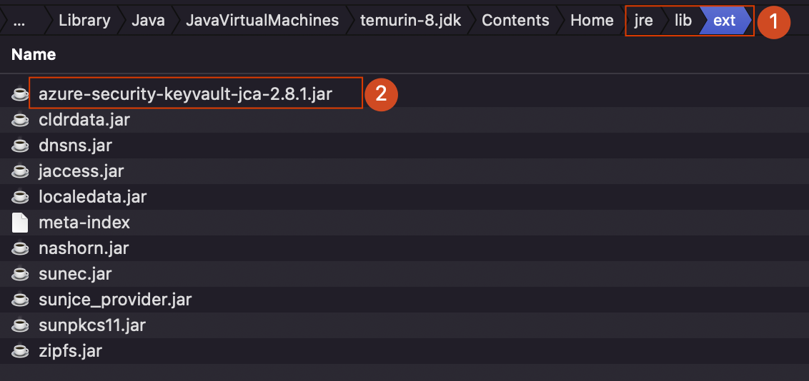
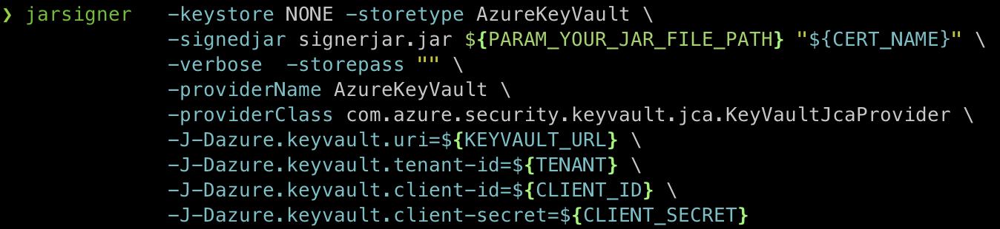
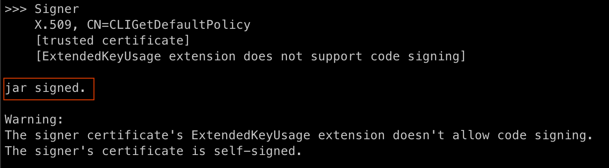
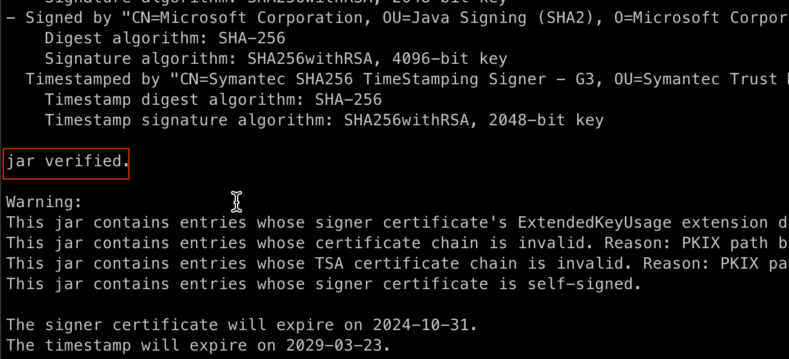

<!-- Refer to https://github.com/Azure/azure-sdk-for-java/issues/35677  -->
<!-- Refer to https://techcommunity.microsoft.com/blog/appsonazureblog/seamlessly-integrating-azure-keyvault-with-jarsigner-for-enhanced-security/4125770 -->
# Integrate KeyVault JCA provider with Jarsigner (PowerShell)

- [Integrate KeyVault JCA provider with Jarsigner (PowerShell)](#integrate-keyvault-jca-provider-with-jarsigner-powershell)
    * [Prerequisites](#prerequisites)
        + [Step 1: Download and Configure JCA Provider Jar](#step-1--download-and-configure-jca-provider-jar)
    * [Step 2: Prepare Azure Resources](#step-2--prepare-azure-resources)
        + [Step 3: Sign with Jarsigner](#step-3--sign-with-jarsigner)
        + [Step 4: Verify with Jarsigner](#step-4--verify-with-jarsigner)
    * [Conclusion](#conclusion)
    * [Clean up resources](#clean-up-resources)

This guide provides a straightforward approach to integrating the KeyVault JCA provider with [Jarsigner](https://docs.oracle.com/javase/8/docs/technotes/tools/unix/jarsigner.html) using PowerShell, ensuring a seamless process for users.

## Prerequisites
Before beginning, ensure you have the following:

- An Azure subscription - [create one for free](https://azure.microsoft.com/free).
- [Java Development Kit (JDK)](/java/azure/jdk/) version 8 or higher.
- [Azure CLI](/cli/azure/install-azure-cli)
- PowerShell 5.1 or higher
- Ensure you are using one of the following supported algorithms: DSA, RSA, or ECDSA.

### Step 1: Download and Configure JCA Provider Jar

1. Download the [JCA](https://repo1.maven.org/maven2/com/azure/azure-security-keyvault-jca/2.8.1/azure-security-keyvault-jca-2.8.1.jar) Provider Jar.
2. If you are using Java8, you need to add the JCA provider jar to the class path.
    1. Place the jar under the folder `${JAVA_HOME}/jre/lib/ext`
        - 
3. If you are using Java9 or higher, just place the jar in a folder that jarsigner can access.
        
## Step 2: Prepare Azure Resources

Follow these steps carefully to achieve successful integration:

1. Prepare your parameters
```powershell
$DATE_STRING = Get-Date -Format "HHmmss"
$RESOURCE_GROUP_NAME = "jarsigner-rg-$DATE_STRING"
$KEYVAULT_NAME = "jarsiner-kv-$DATE_STRING"
$CERT_NAME = "jarsiner-cert-$DATE_STRING"
$SERVICE_PRINCIPAL_NAME = "jarsiner-sp-$DATE_STRING"
$SUBSCRIPTION_ID = (az account show --query id -o tsv)
```

2. Create a resource group
```powershell
az group create --name $RESOURCE_GROUP_NAME --location "WestUS"
```

3. Create a key vault
```powershell
az keyvault create --name $KEYVAULT_NAME --resource-group $RESOURCE_GROUP_NAME --location "WestUS"
```

4. Assign role to the Key Vault.

```shell
# Get your user object ID (if you're using a user account)
$USER_OBJECTID= (az ad signed-in-user show --query id -o tsv)

# Or if you're using a service principal, get its object ID
# $SP_OBJECTID = (az ad sp show --id <your-sp-id> --query id -o tsv)

# Assign Key Vault Certificates Officer role
az role assignment create `
    --role "Key Vault Certificates Officer" `
    --assignee $USER_OBJECTID `
    --scope "/subscriptions/$SUBSCRIPTION_ID/resourceGroups/$RESOURCE_GROUP_NAME/providers/Microsoft.KeyVault/vaults/$KEYVAULT_NAME"
    
```

5. Get the key vault uri
```powershell
$KEYVAULT_URL = (az keyvault show --name $KEYVAULT_NAME --query "properties.vaultUri" --resource-group $RESOURCE_GROUP_NAME -o tsv).Trim()
Write-Host $KEYVAULT_URL
```
Note the output as kv_uri for later use.

6. Add a certificate to Key Vault
```powershell
# Save the default policy to a file
az keyvault certificate get-default-policy > default-policy.json

# Create the certificate using the policy file
az keyvault certificate create --vault-name $KEYVAULT_NAME -n $CERT_NAME -p "@default-policy.json"
```

7. Create a Service Principal
```powershell
$SP_JSON = az ad sp create-for-rbac --name $SERVICE_PRINCIPAL_NAME | ConvertFrom-Json

$CLIENT_ID = $SP_JSON.appId
$CLIENT_SECRET = $SP_JSON.password
$TENANT = $SP_JSON.tenant

Write-Host "CLIENT_ID: $CLIENT_ID"
Write-Host "CLIENT_SECRET: $CLIENT_SECRET"
Write-Host "TENANT: $TENANT"
```
Note the appId and password from the output, you'll need them later.

8. Get the objectId
```powershell
$OBJECTID = (az ad sp show --id $CLIENT_ID --query id -o tsv).Trim()
Write-Host $OBJECTID
```

9. Assign Roles to Service Principal:
```powershell
# Assign Key Vault Secrets Officer role to Service Principal
az role assignment create `
    --role "Key Vault Secrets Officer" `
    --assignee $OBJECTID `
    --scope "/subscriptions/$SUBSCRIPTION_ID/resourceGroups/$RESOURCE_GROUP_NAME/providers/Microsoft.KeyVault/vaults/$KEYVAULT_NAME"

# Assign Key Vault Certificates Officer role Service Principal
az role assignment create `
    --role "Key Vault Certificates Officer" `
    --assignee $OBJECTID `
    --scope "/subscriptions/$SUBSCRIPTION_ID/resourceGroups/$RESOURCE_GROUP_NAME/providers/Microsoft.KeyVault/vaults/$KEYVAULT_NAME"
```

### Step 3: Sign with Jarsigner

1. **Prepare Your Jar**: Have the jar file you wish to sign ready.
2. **Execute Jarsigner**: Use the Jarsigner tool with the KeyVault JCA provider to sign your jar file.  
    You need to update the parameters with the actual values.   

    | Parameter | Description |Example|
    |---|---|---|
    | **PARAM_YOUR_JAR_FILE_PATH** | The path to your jar file you wish to sign. | C:\path\to\your\jarfile.jar |
    | **PARAM_JCA_PROVIDER_JAR_PATH** | The path to the jca provider jar file. | C:\path\to\your\azure-security-keyvault-jca-2.8.1.jar |

    1. If you are using Java8, try to sign the jar using below command
         ```powershell
         jarsigner -keystore NONE -storetype AzureKeyVault `
                  -signedjar signerjar.jar ${PARAM_YOUR_JAR_FILE_PATH} "${CERT_NAME}" -verbose -storepass '""' `
                  -providerName AzureKeyVault `
                  -providerClass com.azure.security.keyvault.jca.KeyVaultJcaProvider `
                  "-J-Dazure.keyvault.uri=${KEYVAULT_URL}" `
                  "-J-Dazure.keyvault.tenant-id=${TENANT}" `
                  "-J-Dazure.keyvault.client-id=${CLIENT_ID}" `
                  "-J-Dazure.keyvault.client-secret=${CLIENT_SECRET}"
         ```

    2. If you are using Java9 or higher, try to sign the jar using below command
         ```powershell
         jarsigner -keystore NONE -storetype AzureKeyVault `
                  -signedjar signerjar.jar ${PARAM_YOUR_JAR_FILE_PATH} "${CERT_NAME}" -verbose -storepass '""' ` 
                  -providerName AzureKeyVault `
                  -providerClass com.azure.security.keyvault.jca.KeyVaultJcaProvider `
                  "-J--module-path=${PARAM_JCA_PROVIDER_JAR_PATH}" `
                  "-J--add-modules=com.azure.security.keyvault.jca" `
                  "-J-Dazure.keyvault.uri=${KEYVAULT_URL}" `
                  "-J-Dazure.keyvault.tenant-id=${TENANT}" `
                  "-J-Dazure.keyvault.client-id=${CLIENT_ID}" `
                  "-J-Dazure.keyvault.client-secret=${CLIENT_SECRET}"
         ```
3. Check your output, the output may look like this
    - 
    - 

### Step 4: Verify with Jarsigner
You can verify the signed jar using the following Jarsigner command.
```powershell
jarsigner -verify -verbose -certs signerjar.jar
```
The output may look like this


## Conclusion

By following these steps, you can easily integrate KeyVault JCA provider with Jarsigner using PowerShell. This method ensures a secure and efficient signing process using Azure KeyVault.

## Clean up resources
To avoid Azure charges, you should clean up unnecessary resources.  

```powershell
az group delete --name $RESOURCE_GROUP_NAME --yes --no-wait
az ad app delete --id $CLIENT_ID
```
